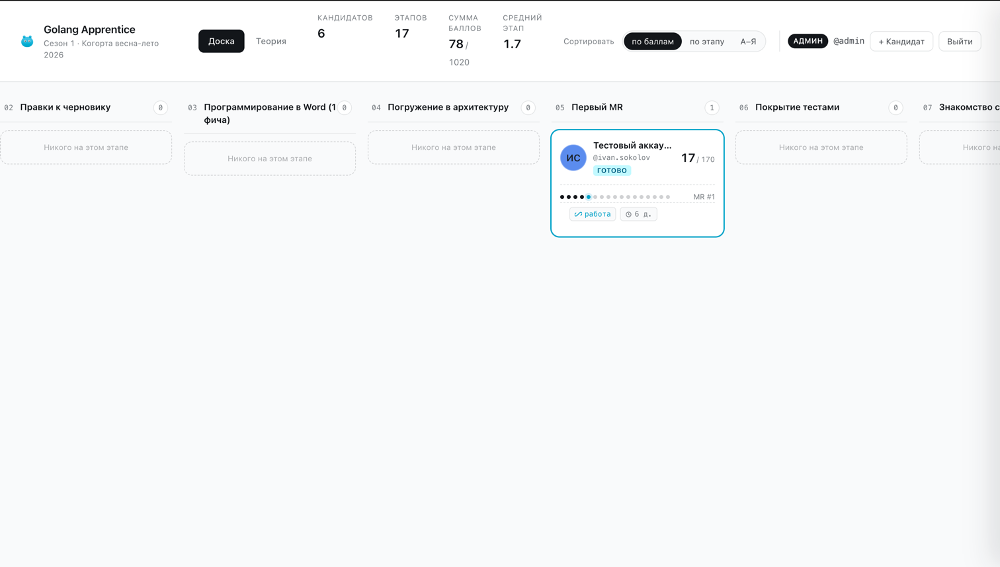
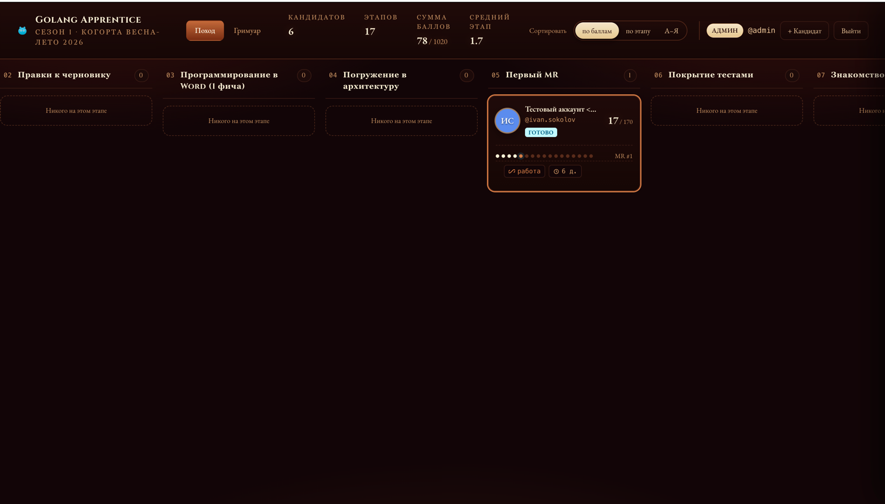
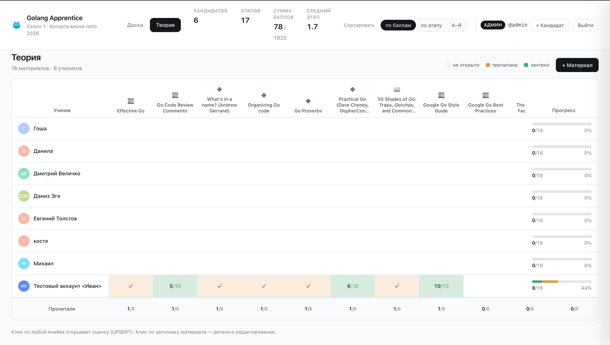
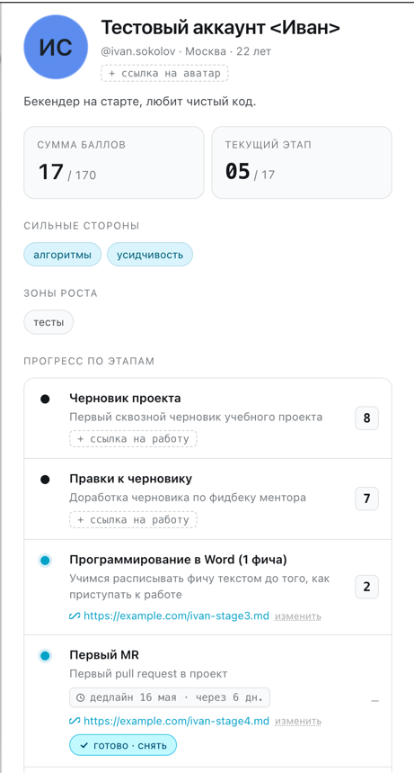

# Golang Apprentice

Бэкенд учебной платформы для курса по Go. Прод-инстанс — <https://kroexov.webhop.me/apprentice/>: ученики регистрируются, ментор/админ ведёт их по этапам курса, выставляет баллы и отмечает прочитанные материалы.

---

## 1. О проекте

Сервис обслуживает один курс с несколькими когортами (сейчас «Сезон 1 · Когорта весна-лето 2026»). Кандидаты двигаются по фиксированному списку этапов; на каждом этапе ментор ставит балл (1..`maxScore`) и кандидат переходит на следующий. Параллельно ведётся учёт прочитанных теоретических материалов.

### Скриншоты фронтенда

Скриншоты лежат в [`docs/readme-img/`](docs/readme-img/). Сам фронт — в отдельном приватном репозитории; он потребляет публичный TS-клиент (`docs/api.ts`), сгенерированный из этого бэкенда.

#### Доска (канбан) — главный экран



Канбан-доска со всеми этапами курса в колонках. На карточке кандидата — аватар с инициалами, ник, текущая сумма баллов / максимум, прогресс-баром обозначены пройденные этапы, рядом — короткий ярлык текущего этапа (например, `MR #1`), плашка статуса (`готово`), ссылка на сданную работу и счётчик до дедлайна. В шапке — счётчики кандидатов, этапов, общая сумма баллов, средний этап, переключатели сортировки (по баллам / по этапу / А–Я) и админский тулбар (`+ Кандидат`, `Выйти`).



Та же доска в тёмной теме — переключение темы реализовано на фронте.

#### Теория — таблица материалов



Матрица «материал × ученик». Колонки — теоретические материалы (статьи, доклады, гайды), строки — кандидаты. Ячейка показывает статус: пусто (не открыто) / `прочитано` (оранжевый чек) / `зачтено` с баллом (зелёный, например `5/10` или просто `✓`). Внизу — суммарка `n/N` сколько человек коснулись материала, справа — общий прогресс кандидата (`8/18 · 44%`). Клик по ячейке — UPSERT оценки, клик по заголовку — детали материала.

#### Карточка кандидата



Подробный профиль: ФИО, ник, город, возраст, био, цветная аватарка с инициалами, теги «сильные стороны» и «зоны роста», текущий этап и сумма баллов. Ниже — список всех этапов с маркерами состояния (`done` / `current` / `todo`), баллами, дедлайнами, ссылками на сданные работы и кнопкой `готово · снять` для перевода кандидата на следующий этап.

---

## 2. Бизнес-логика и устройство бэкенда

Базис проекта — шаблон [vmkteam/gold-apisrv](https://github.com/vmkteam/gold-apisrv). Стек:

- **Go 1.25**, модуль `apisrv` (бинарь тоже `apisrv` — название хранится в `Makefile.mk`).
- **PostgreSQL** + [`go-pg/v10`](https://github.com/go-pg/pg) (через форк `vmkteam/pg/v10`, прибит `replace` в `go.mod` — не сносить при обновлениях).
- **JSON-RPC** через [`vmkteam/zenrpc`](https://github.com/vmkteam/zenrpc) — два независимых сервера на одном `echo`-инстансе.
- **mfd-generator** — генерация моделей, репозиториев и search-структур БД из `docs/model/apisrv.mfd`.
- **zenrpc** (`go tool zenrpc`) — генерация роутера и SMD из doc-комментариев в RPC-сервисах.
- **goconvey** BDD-стиль для тестов; тесты бьют по живой PostgreSQL — никаких моков.
- `embedlog` для структурного логирования, `appkit` для метаданных и pprof, `sentry-go` опционально.

### Доменная модель

Полный контракт API — в [`docs/RPC.md`](docs/RPC.md), исходная схема — в [`docs/apisrv.sql`](docs/apisrv.sql). Сущности:

- **`stages`** — этапы курса. Поля: `stageId`, `alias` (slug, regex `^[a-z0-9.\-_]{2,64}$`), `order` (порядковый номер), `title` (≤ 255), `shortTitle` (≤ 64), `description`, `maxScore` (1..100, дефолт 10), `deadlineDays` (0..365, дефолт 0; 0 = без дедлайна), `statusId`. `alias` и `order` уникальны **partial** (`WHERE statusId <> 3`), так что после soft-delete значение освобождается. `stage.reorder` использует двухфазное обновление с большим offset, чтобы не упасть на UNIQUE при перетасовке.
- **`candidates`** — ученик. Помимо профильных полей (`name`, `handle`, `city`, `age`, `bio`, `avatarColor`, `initials`, `avatarUrl`, `strengths[]`, `weaknesses[]`) кандидат — **полноценный пользователь сервиса**: у него есть собственные `login`, `password` (bcrypt cost-14), `authKey` (32-символьный URL-safe токен), `lastActivityAt`. CHECK-констрейнты на уровне БД: `age` 14..120 либо `NULL`, `handle`/`login` regex `^[a-z0-9.\-_]{2,40}$`, `initials` 1..3 символа, `strengths`/`weaknesses` до 10 штук. `handle` и `login` уникальны partial (по не-удалённым). Индекс `IX_candidates_authKey` partial по `authKey IS NOT NULL` — для быстрого lookup в middleware. `currentStageId` — указатель на текущий этап (FK на `stages` с `ON DELETE RESTRICT`), `completedAt` ставится при `advance` последнего этапа.
- **`candidateStages`** — прохождение этапа кандидатом (это именно та сущность, что в `FUNCTIONALITY.md` черновиком названа `StageScore`, но в коде и схеме — `CandidateStage`). Объединяет «попадание на этап» и «оценку за этап» в одну строку. Поля: `candidateStageId`, `candidateId` (FK ON DELETE CASCADE), `stageId` (FK RESTRICT), `link` (ссылка на сданную работу), `score` (1..100 либо NULL), `scoredAt`, `scoredBy` (FK на `users`, ON DELETE SET NULL), `deadline` (`createdAt + stage.deadlineDays`, фиксируется в момент попадания и **не пересчитывается** при изменении этапа), `isReady`/`setReadyAt`/`retries` (workflow «готово к проверке»; на admin-`setReady(false)` поверх `true` `retries` инкрементится), `createdAt`. Уникальность по `(candidateId, stageId)`. CHECK-констрейнт `scored_consistency`: `score` и `scoredAt` либо оба `NULL`, либо оба `NOT NULL`.
- **`materials`** — теоретические материалы (книги/статьи/видео/тесты/прочее). `type` ограничен enum через CHECK (`book|article|video|test|other`), `url` ≤ 2048 (тоже CHECK), `maxScore` 1..100, `order` для сортировки в UI. `title` и `order` уникальны partial (по не-удалённым).
- **`candidateMaterials`** — прогресс кандидата по материалу. Уникальность по `(candidateId, materialId)`, запись создаётся **лениво**: либо первой попыткой `material.setRead(true)` (тогда `readAt = now()`, `score`/`scoredAt`/`scoredBy` = NULL), либо первой админской оценкой через `material.score` (тогда `readAt` может остаться NULL, а `score`/`scoredAt`/`scoredBy` заполнены). До этого пары в БД нет, и UI трактует ячейку как «не отмечен». `readAt` фиксирует **момент первой отметки** — повторный `setRead(true)` его не сдвигает. CHECK-констрейнт `scored_consistency`: `score`/`scoredAt`/`scoredBy` все вместе `NULL` или все вместе `NOT NULL`. FK: `candidateId` ON DELETE CASCADE, `materialId` ON DELETE RESTRICT, `scoredBy` ON DELETE SET NULL.
- **`users`** — админы/менторы. Те же `login`/`password`/`authKey`/`lastActivityAt`, что и у кандидатов, но в отдельной таблице. Самостоятельная регистрация админов отключена — заводятся только сидом или вручную в БД.
- **`statuses`** — справочник из трёх строк (1 = enabled, 2 = disabled, 3 = deleted). Soft-delete по всему проекту — это `statusId → 3`, отфильтровывается `StatusFilter` в репозиториях. Партиальные уникальные индексы (`handle`/`login`/`alias`/`order`/`title`) — `WHERE statusId <> 3`, так что после удаления значения переиспользуются.

#### Ключевые инварианты и операции

- **`candidateStages` инвариант**: для каждого незавершённого (`completedAt IS NULL`) кандидата существует **ровно одна** запись без оценки — для его `currentStageId`. Все более ранние записи имеют не-NULL `score`/`scoredAt`. У завершённого — все записи оценены, `currentStageId` остаётся на последнем этапе.
- **Создание `candidateStages` всегда автоматическое** — через `candidate.add` / `auth.register` / `auth.signUp` (для начального этапа = первый активный stage) и `candidate.advance` (для следующего). Прямого RPC для создания записи нет.
- **`candidate.advance` (главная операция)** — атомарно: проставляет `score`/`scoredAt` пустой записи текущего этапа → создаёт пустую запись для следующего (или ставит `completedAt`, если этапов больше нет) → двигает `currentStageId`.
- **Откат (`candidate.rollback`)** — удаляет пустую запись текущего этапа и стирает `score`/`scoredAt` у предыдущей; кандидат «возвращается» на этап без оценки. `deadline` не пересчитывается.
- **`isReady` workflow**: чтобы кандидат поставил `setReady(true)`, у `candidateStage` должен быть прикреплён `link`. Админ может снять `setReady` обратно — тогда `retries` атомарно инкрементится (для трекинга количества доработок).

#### Три уровня доступа

В `pkg/rpc/middleware.go` методы делятся на:

- **open** — без `Authorization2`-заголовка (`auth.login`, `auth.signUp`, `auth.register`, `*.get`, `*.getById`, `dashboard.summary`, `material.getProgress`); если заголовок есть и валиден — principal подмешивается «оппортунистически».
- **registered** — нужен любой валидный authKey, admin **или** candidate (`auth.me`, `candidate.setLink`, `candidate.setAvatarUrl`, `candidate.setReady`, `candidate.updateProfile`, `material.setRead`, `material.getMyProgress`); кандидат может менять только свои объекты, админ — любые.
- **protected** (всё остальное) — только admin. Кандидатский authKey возвращает `401`.

В `candidateStages.scoredBy`/`candidateMaterials.scoredBy` пишется `userId` админа из контекста; кандидаты сами оценок не ставят.

#### Сидинг

`docs/init.sql` идемпотентен (re-run = no-op). В нём:

- Справочник `statuses` (3 строки).
- Один админ — `admin` / пароль `12345` (bcrypt cost-14).
- 15 этапов реального курса (черновик проекта → правки → программирование в Word → MR → pgDesigner → go-pg → mfd-generator → colgen → JWT → zenrpc → SPA → фронт-клиент → финальная фича → финальный MR → созвон с админом).
- 5 сидовых кандидатов (логины `ivan.sokolov`, `maria.petrova`, `alex.ivanov`, `olga.novikova`, `dmitry.kuznetsov`), пароль у всех тоже `12345`.

#### VFS-таблицы

В `apisrv.sql` присутствуют `vfsFiles`, `vfsFolders`, `vfsHashes` — это инфраструктура шаблона `gold-apisrv`. В apprentice они не используются (см. секцию «Что можно вырезать»).

### HTTP-поверхность

| Путь | Назначение |
| --- | --- |
| `/v1/rpc/` | Публичный JSON-RPC (`auth`, `candidate`, `stage`, `material`, `dashboard`) |
| `/v1/rpc/doc/` | SMDBox UI публичного API |
| `/v1/rpc/openrpc.json` | OpenRPC документ |
| `/v1/rpc/api.ts` | TypeScript-клиент публичного API (его и потребляет фронт) |
| `/v1/vt/` | Админский JSON-RPC (`auth`, `user`) с `Authorization2`-заголовком |
| `/v1/vt/doc/` | SMDBox UI VT |
| `/v1/vt/api.ts` | TypeScript-клиент VT (с классами) |
| `/status` | Healthcheck (пингует БД) |
| `/metrics` | Prometheus |
| `/debug/pprof/*` | pprof |
| `/debug/metadata` | appkit-метаданные |
| `/` | Список роутов (только в `IsDevel`) |

Дефолтный порт — `8075`.

### Авторизация

`Authorization2`-заголовок — единый bearer-токен и для админа, и для кандидата. Middleware (`pkg/rpc/middleware.go`) делит методы на три уровня:

- **open** — без заголовка (например, `auth.login`, `auth.signUp`, `candidate.get`, `dashboard.summary`); если заголовок есть и валиден, principal подмешивается «оппортунистически».
- **registered** — нужен любой принципал (admin или candidate); per-row проверки внутри метода (`candidate.updateProfile`, `material.setRead`, …).
- **protected** (всё остальное) — только admin.

В `StageScore.scored_by`/`updated_by` пишется, кто проставил оценку.

### Кодогенерация — что от чего зависит

```
docs/model/apisrv.mfd
        │
        ├─ make mfd-model  → pkg/db/{model,model_search,model_validate,model_params}.go
        ├─ make mfd-repo NS=<ns> → pkg/db/<ns>.go (репозитории)
        └─ make mfd-db-test → pkg/db/test/

pkg/rpc/*.go (с doc-комментариями //zenrpc:...)
        │
        └─ make generate (go generate ./pkg/rpc)
                  → pkg/rpc/rpc_zenrpc.go (роутер + SMD)
                                │
                                ├─ make api-ts → docs/api.ts (TS-клиент для фронта)
                                └─ runtime: /v1/rpc/api.ts, /v1/rpc/openrpc.json
```

Хэнд-врайтенные расширения сгенерированных репозиториев лежат в `pkg/db/apprentice_ext.go` и `pkg/db/apprentice_auth_ext.go` — править их можно; сами `apprentice.go`, `common.go`, `model*.go` — нельзя (затрутся).

### Тесты

```sh
make test          # полный цикл, требует $TEST_PGDATABASE
make test-short    # отфильтровано регэкспом Test[^D][^B] — без БД
```

Конвенция: тесты, которым нужна реальная БД, называются `TestDB...` или `TestBatch...` — тогда `test-short` их пропустит.

---

## 3. Локальный запуск

### Требования

- Go 1.25.
- PostgreSQL (локальная или в Docker), доступ из консоли через `psql`/`createdb`/`dropdb`.
- `make`.

### Первый запуск

```sh
make init   # копирует Makefile.mk.dist → Makefile.mk и cfg/local.toml.dist → cfg/local.toml
make tools  # ставит mfd-generator, pgmigrator, colgen, golangci-lint v2.8.0
```

После `make init` отредактируйте:

1. **`Makefile.mk`** — имя БД, креды Postgres:
   ```make
   PGDATABASE ?= apprentice
   PGHOST     ?= localhost
   PGPORT     ?= 5432
   PGUSER     ?= postgres
   PGPASSWORD ?= postgres
   TEST_PGDATABASE ?= test-apprentice
   ```
2. **`cfg/local.toml`** — те же значения в секции `[Database]`:
   ```toml
   [Database]
   Addr     = "localhost:5432"
   User     = "postgres"
   Password = ""
   Database = "apprentice"
   ```

### Создание и заполнение БД

`make db` делает всё за один проход — пересоздаёт БД и накатывает схему + сид:

```sh
make db
# эквивалент:
#   dropdb --if-exists -f apprentice
#   createdb apprentice
#   psql -f docs/apisrv.sql apprentice   # схема
#   psql -f docs/init.sql   apprentice   # справочники + сидовые этапы/кандидаты
```

После этого есть готовый админ `admin` / пароль `12345` и пять сидовых кандидатов (тоже `12345`).

Тестовая БД накатывается аналогично:

```sh
make db-test  # пересоздаёт $TEST_PGDATABASE
```

### Запуск сервиса

```sh
make run    # go run ./cmd/apisrv -config=cfg/local.toml -dev
```

Сервис поднимется на `http://localhost:8075`. Полезные точки входа:

- `http://localhost:8075/v1/rpc/doc/` — интерактивный SMDBox по публичному API.
- `http://localhost:8075/v1/vt/doc/` — то же для VT (админ).
- `http://localhost:8075/status` — healthcheck.
- `http://localhost:8075/` — список всех роутов (только в `-dev`).

### Регенерация бэкенда после изменений

#### Поправили SQL-схему вручную

1. Накатить миграцию на локальную БД (или `make db` для полного пересоздания).
2. `make mfd-xml` — обновить `docs/model/apprentice.xml` с реальной схемы.
3. `make mfd-model` — перегенерировать `pkg/db/model*.go`.
4. `make mfd-repo NS=apprentice` — перегенерировать `pkg/db/apprentice.go` (для `NS=common` — `common.go`).
5. Обновить `docs/apprentice.pgd` (pgDesigner) и `docs/RPC.md`, если поменялись публичные структуры.

#### Добавили/изменили RPC-метод

1. Меняем код в `pkg/rpc/<service>.go` (doc-комментарии `//zenrpc:...` — без бэктиков, иначе `make generate` ругнётся непонятным AST-эррором).
2. `make generate` — перегенерируется `pkg/rpc/rpc_zenrpc.go`.
3. `make api-ts` — обновится `docs/api.ts` для фронта.
4. `make fmt lint test` — обязательный финальный прогон.

#### Done-checklist перед пушем

```sh
make fmt lint test
```

Все три должны быть зелёные. Если тестовая БД пустая или схема устарела — сначала `make db-test`.

